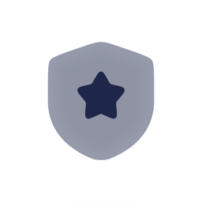

<p align="center">
  
</p>

<h1 align="center">Olisar Secure Console</h1>

<p align="center">
  A self-hosted AI Discord bot that feels like a <em>living member</em> of your server —
  with a private admin dashboard, persistent memory, and a teachable knowledge base.
</p>

---

Olisar reads the channels you allow, remembers context, builds a sense of who people
are, and chimes in with its own personality — by name, by @mention, by reply, in DMs,
through `/ask`, or proactively when it can genuinely help. Everything is configured from
a **React admin dashboard** (Discord-OAuth, admins only), and it runs entirely on the
**free tier of Google Gemini** — no paid APIs.

You run it yourself: **one desktop app** on your own machine hosts the bot, the API, and
the dashboard together. There's no server to rent and no cloud — all of your data stays
local.

## Highlights

- **Feels alive** — persona you author, a private impression it forms of each member,
  and four ways to engage (name trigger, @mention/reply, DM, `/ask`) plus optional
  proactive chiming with cooldowns and quiet hours.
- **Remembers** — rolling channel summaries, semantic recall, durable facts, and a
  server-wide message **search index** ("where was that link posted?") that answers with
  a jump-link. Members control their own data with `/privacy` and `/forget-me`.
- **Learns** — teach it web pages, whole sites (crawled), and uploaded docs
  (PDF/DOCX/TXT/MD); it chunks + embeds them in the background and draws on them in its
  own voice. A small glossary carries your community's dialect into every reply.
- **Sees & draws** — looks at posted images, describes them for search, and generates
  images (Cloudflare Workers AI, optional).
- **Fully customizable** — persona, behavior, per-channel modes, role-based access,
  knowledge, extensions, and **every system/command reply** (with `{placeholder}`
  templates) — all from the dashboard, applied live with no restart.
- **Extensible** — toggle packaged features (dice, calculator, concise mode) and a full
  **Star Citizen** pack (live trade/ship/location tools + `/citizen` profiles).
- **Secure by design** — Discord-OAuth login, admins only, with **live permission
  re-checks**: lose Manage Server and your console access is revoked on the next request.
- **Free to run** — each install uses *your own* Discord bot and *your own* free API
  keys, so you stay on the free tiers; it auto-falls-back across a ranked chain of Gemini
  models when one is rate-limited.

## Get started

👉 **[SETUP.md](SETUP.md)** — the full setup guide: install the desktop app, create your
Discord application, the first-run wizard, optional remote access, and building from
source.

In short:

1. Install the desktop app (or run it from source — see the setup guide).
2. Create a Discord application, enable the **Message Content** + **Server Members**
   intents, and invite the bot to your server.
3. Launch Olisar and complete the first-run wizard (bot token, OAuth client ID/secret,
   a free [Gemini key](https://aistudio.google.com/apikey)).
4. Sign in to the console with the Discord account that has **Manage Server**.

There's also a complete **Docs** section inside the dashboard (overview, persona,
behavior, channels, access, knowledge, memory, members, images, extensions, privacy, and
troubleshooting).

## Remote access

By default the console is local-only. To let other admins sign in from anywhere, Olisar
can publish the dashboard over **Tailscale Funnel** — a free, stable `https://…ts.net`
address with **no domain and no port-forwarding required**. The operator needs a free
Tailscale account; the admins who sign in don't need Tailscale at all. See
[SETUP.md](SETUP.md#4-remote-access-optional--tailscale-funnel).

## Updates

Olisar checks this repo's latest **GitHub Release** on launch and every few hours (and on
demand from the tray → *Check for Updates…*). When a newer version is published it can
**install it in place** — *Install & Restart* downloads the new build, swaps the app, and
relaunches into the new version (no manual drag-to-Applications, even though the app is
unsigned). On platforms it can't self-install yet, it falls back to opening the installer
download. Maintainers: see **[RELEASING.md](RELEASING.md)** for how to cut a release (a tag
push builds and publishes the installers via GitHub Actions).

## How it's built

- **Python 3.13** (managed with [uv](https://docs.astral.sh/uv/)) — discord.py bot +
  FastAPI, run together on one asyncio loop.
- **SQLite** with [`sqlite-vec`](https://github.com/asg017/sqlite-vec) + FTS5 for hybrid
  semantic + keyword search; all data is local.
- **Google Gemini** (free tier) for chat, embeddings, vision, and web-grounded search.
- **React + Vite + TypeScript** dashboard, served same-origin by the backend.
- **Electron** desktop shell (macOS + Windows) bundling the PyInstaller backend, the
  dashboard, `sqlite-vec`, and a Tailscale Funnel helper.

```
olisar/    shared core — db models, config, runtime, persona, memory, knowledge, gemini
bot/       the discord.py process (cogs: conversation, members, slash, presence, …)
api/       FastAPI admin backend (auth, routers) — serves the dashboard same-origin
web/       React dashboard (Vite + TypeScript)
desktop/   Electron shell, PyInstaller spec, Tailscale Funnel sidecar
scripts/   init_db.py and other one-offs
```

## Privacy

Everything Olisar knows lives in a single local database on the operator's machine —
there is no Olisar cloud. Opted-out members are never recorded or indexed; `/forget-me`
removes a person entirely; `/self-destruct` wipes everything learned while keeping the
persona and settings. The all-channel search index is an admin's explicit choice and is
disclosed by `/privacy`. See the in-dashboard **Privacy** doc for the full picture.

## License

MIT.
